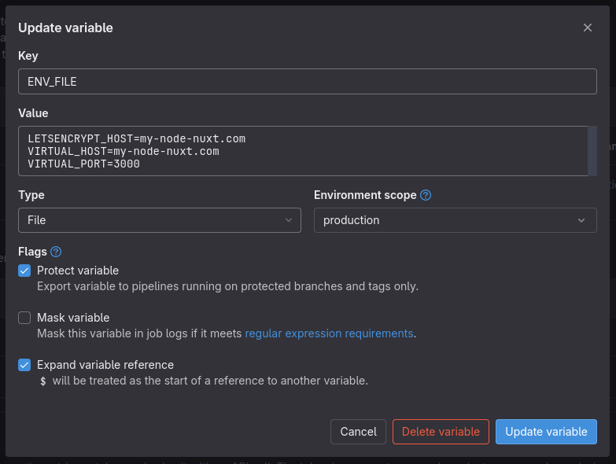

# node-nuxt
Example of a TypeScript [Nuxt v3](nuxt.com/) application.

### Prerequisites:
- CI/CD file variable `ENV_FILE`:
  - you can create more environment scopes, such as "production", "staging" etc. and for each of them create a different `.env` file:
    
  - since the `$ENVIRONMENT` variable is set to the correct environment scope in the workflow rules, the correct `.env` file will be copied to the root of the application

### The deployment stages are:
1. `dependencies`
   - install npm dependencies via [pnpm](pnpm.io/)
2. `validate`
   - check the application validity and correctness
   1. `lint`
      - run [eslint](eslint.org/) on the application
   2. `build`
      - build the application
      - push the built Docker image it to the "local" Container Registry
3. `deploy`
   - use docker compose to deploy the built Docker image from the registry
